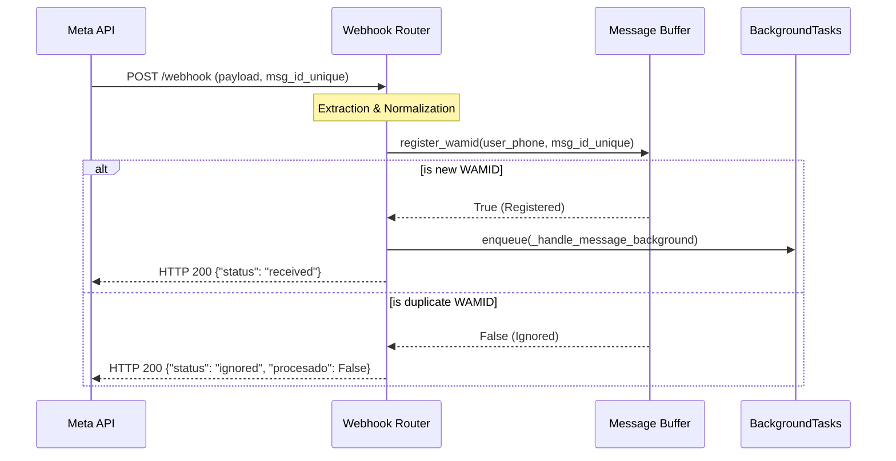

# Quick Task 171: Hotfix Webhook Idempotency Lock

## Objective
Implement a synchronous idempotency guardrail in the WhatsApp webhook router boundary (`app/routers/whatsapp.py`) to drop duplicate Meta requests (Webhook Retry Storms) before they are enqueued into BackgroundTasks or Cloud Tasks.

---

## Documento Técnico de Planificación (JSON Voorhees)

### 1. Arquitectura de Control de Idempotencia Síncrona
El flujo de control de entrada para mensajes del usuario en el Webhook de Meta sigue la siguiente arquitectura:



### 2. Esquemas y Contratos de Datos (JSON)

```json
{
  "api_contracts": {
    "webhook_response_success": {
      "type": "object",
      "properties": {
        "status": { "type": "string", "enum": ["received"] }
      },
      "required": ["status"]
    },
    "webhook_response_ignored": {
      "type": "object",
      "properties": {
        "status": { "type": "string", "const": "ignored" },
        "procesado": { "type": "boolean", "const": false }
      },
      "required": ["status", "procesado"]
    }
  },
  "in_memory_state": {
    "MessageBuffer": {
      "_processed_wamids": {
        "type": "object",
        "additionalProperties": {
          "type": "array",
          "items": { "type": "string" },
          "maxItems": 100
        }
      },
      "_added_wamids": {
        "type": "object",
        "description": "Tracks WAMIDs for which text has been successfully added to the message buffer.",
        "additionalProperties": {
          "type": "array",
          "items": { "type": "string" },
          "maxItems": 100
        }
      }
    }
  }
}
```

---

## Tasks

<task type="auto">
  <name>Refactor MessageBuffer to support decoupled registration and buffering</name>
  <files>[app/services/message_buffer.py](file:///Users/tobiasgaitangallego/Bot-TiendaLasMotos/app/services/message_buffer.py)</files>
  <action>Add `self._added_wamids` to `MessageBuffer` to track which WAMIDs have actually had their text appended to the buffer via `add_message`. Modify `add_message` to check against `_added_wamids` instead of `_processed_wamids` to prevent premature duplication rejection when running the background task. Modify `register_wamid` to correctly populate `_processed_wamids` in a synchronized block.</action>
  <verify>Run the existing test suite.</verify>
  <done>MessageBuffer tests pass, and the class exposes `_added_wamids` and `_processed_wamids` as expected.</done>
</task>

<task type="auto">
  <name>Surgically patch webhook_handler for synchronous idempotency check</name>
  <files>[app/routers/whatsapp.py](file:///Users/tobiasgaitangallego/Bot-TiendaLasMotos/app/routers/whatsapp.py)</files>
  <action>In the user message branch of `webhook_handler`, invoke `await message_buffer.register_wamid(user_phone, msg_id_unique)` synchronously. If it returns False, return `{"status": "ignored", "procesado": False}` immediately.</action>
  <verify>Run the entire test suite.</verify>
  <done>All previous tests pass successfully with the new blocking guardrail in place.</done>
</task>

<task type="auto">
  <name>Crear test de caracterización test_concurrent_webhook_idempotency</name>
  <files>[tests/test_router_concurrency.py](file:///Users/tobiasgaitangallego/Bot-TiendaLasMotos/tests/test_router_concurrency.py)</files>
  <action>Create a characterization test simulating concurrent incoming requests with the same WAMID. Assert that only the first request is enqueued and the second is immediately rejected with `{"status": "ignored", "procesado": False}`.</action>
  <verify>Run `pytest tests/test_router_concurrency.py`</verify>
  <done>Test passes successfully.</done>
</task>

---
*Created: 2026-07-12*
